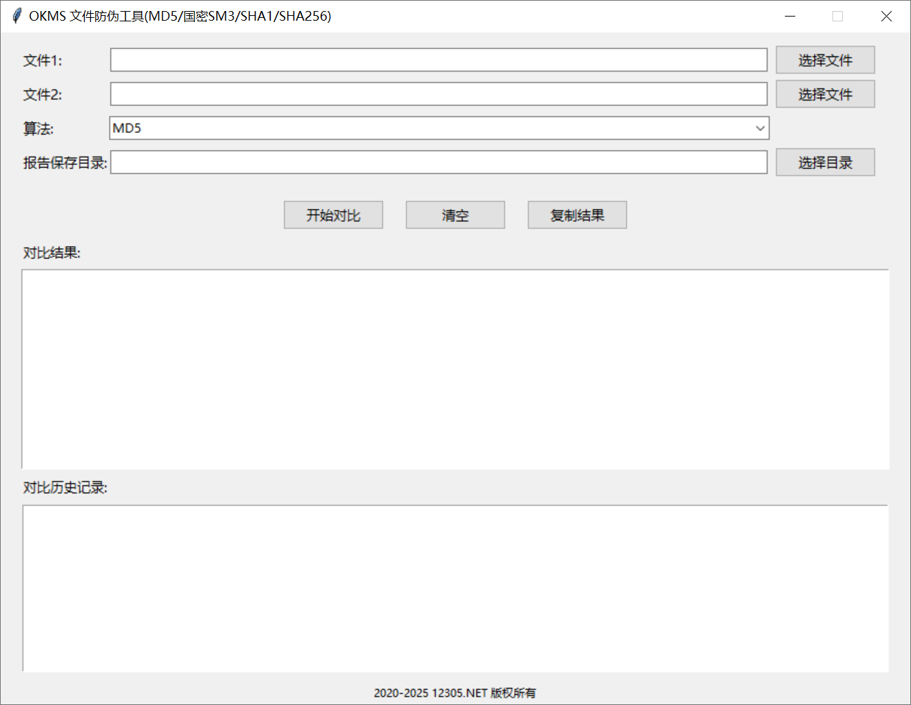

# OKMS 文件防伪工具

## 环境配置

在开始使用 OKMS 文件防伪工具之前，您需要配置好 Python 开发环境。请按照以下步骤操作：

### 创建虚拟环境

首先，打开终端或命令提示符，执行以下命令以创建一个新的虚拟环境：

```bash
python3 -m venv venv
```

### 激活虚拟环境

创建虚拟环境后，需要激活它。根据您的操作系统，执行以下命令之一：

- **Windows**:

  ```bash
  venv\Scripts\activate
  ```

- **macOS/Linux**:

  ```bash
  source venv/bin/activate
  ```

### 安装依赖包

虚拟环境激活后，使用 `pip` 安装项目所需的依赖包。请确保您位于项目的根目录下，并执行以下命令：

```bash
pip install -r requirements.txt
```

## 构建打包 `.exe` 文件的方法

为了将 OKMS 文件防伪工具打包成可执行的 `.exe` 文件，您需要安装 `pyinstaller` 并使用它进行打包。以下是详细步骤：

### 安装 PyInstaller

在终端或命令提示符中执行以下命令以安装 `pyinstaller`：

```bash
pip install pyinstaller
```

### 打包应用程序

安装完成后，使用以下命令将您的 Python 脚本打包成 `.exe` 文件：

```bash
pyinstaller -F -w -i icon.ico app.py
```

#### 参数说明：

- `-F`：将应用程序打包成一个单一的 `.exe` 文件，方便分发和使用。
- `-w`：不显示命令行窗口（适用于 GUI 窗口程序），确保用户体验更加流畅。
- `-i icon.ico`：指定应用程序的图标文件，增强品牌识别度。请确保 `icon.ico` 文件位于当前目录或提供正确的路径。
- `app.py`：您的主要 Python 脚本文件名，请根据实际情况进行修改。

### 打包结果

打包完成后，`.exe` 文件将生成在项目根目录下的 `dist` 文件夹中。该可执行文件兼容 Windows 10 和 Windows 11 操作系统，确保在各种 Windows 环境下都能正常运行。


*打包成功后，您将在 `dist` 文件夹中找到生成的 `exe` 文件。*



## 注意事项

- **依赖项**：确保所有项目依赖项已正确安装在虚拟环境中，以避免打包过程中出现缺失模块的问题。
- **图标文件**：使用高质量的 `.ico` 图标文件，以确保在不同分辨率下显示效果良好。
- **测试**：在分发之前，建议在目标系统上测试生成的 `.exe` 文件，确保其功能正常。

通过以上步骤，您可以轻松地将 OKMS 文件防伪工具打包成独立的 `.exe` 应用程序，方便用户在没有 Python 环境的情况下使用。如有任何问题，请参考项目文档或联系技术支持团队获取帮助。